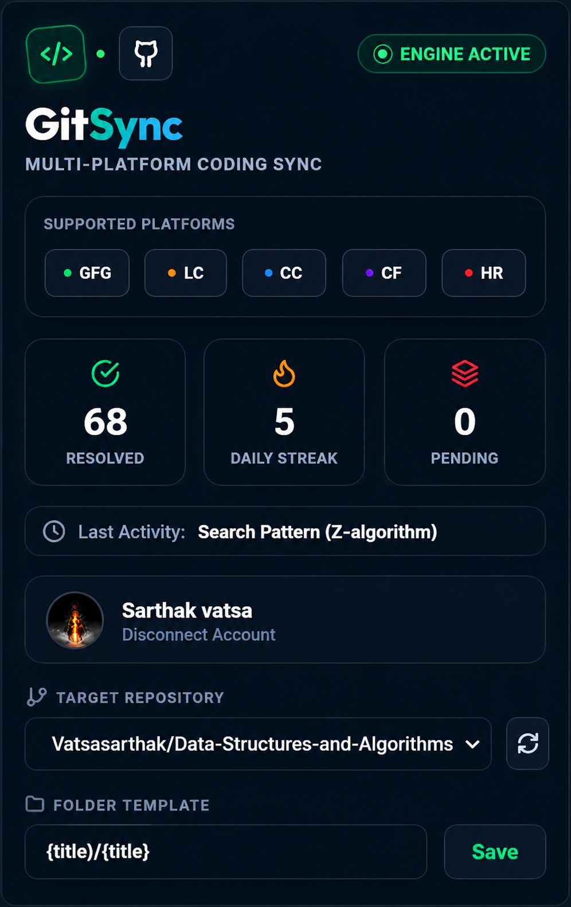

# 🚀 GitSync

> Automatically sync your coding solutions from **GeeksforGeeks, LeetCode, CodeChef, Codeforces, HackerRank** directly to GitHub—**no copy-paste, no manual work**. Just code, solve, and sync! ⚡

[](https://github.com/Vatsasarthak/GitSync)
[](https://github.com/Vatsasarthak/GitSync)
[](LICENSE)
[](https://github.com/Vatsasarthak/GitSync/issues)

---

## 🤔 The Problem

You're solving coding problems on **multiple platforms**—GeeksforGeeks, LeetCode, CodeChef, Codeforces, HackerRank. But your GitHub remains empty. Your portfolio doesn't reflect your effort. **M[...]

## ✨ The Solution: GitSync

GitSync **automatically** detects your accepted submissions, extracts the code, and commits it to GitHub with proper organization. Your GitHub portfolio stays **active and impressive** while you f[...]

---

## 🎯 Why GitSync?

| Feature | Before | After |
|---------|--------|-------|
| **Time to update GitHub** | 5-10 mins per solution | ~2 seconds (automatic) |
| **Portfolio visibility** | Empty/outdated | Fresh daily commits |
| **Multiple platforms** | Manual management | One-click sync |
| **Organization** | Scattered folders | Platform-organized structure |

---

## ✨ Core Features

- ✅ **Automatic Detection** - Detects accepted submissions in real-time
- ✅ **Multi-Platform Support** - GeeksforGeeks, LeetCode, CodeChef, Codeforces, HackerRank
- ✅ **Smart Organization** - Auto-creates folder structure by platform & difficulty
- ✅ **Duplicate Prevention** - Avoids pushing duplicate solutions
- ✅ **Offline Queue** - Works even when offline, syncs when back online
- ✅ **One-Click Setup** - GitHub OAuth integration, no complicated setup
- ✅ **Retry Mechanism** - Auto-retries failed syncs
- ✅ **Manual Sync** - Push solutions anytime with one click
- ✅ **Metadata Rich** - Problem description, difficulty, tags in commits

---

## 🔥 Supported Platforms

| Platform | Status | Auto-Detect | Manual Sync |
|----------|--------|-------------|------------|
| **GeeksforGeeks** | ✅ Active | ✅ Yes | ✅ Yes |
| **LeetCode** | ✅ Active | ✅ Yes | ✅ Yes |
| **CodeChef** | ✅ Active | ✅ Yes | ✅ Yes |
| **Codeforces** | ✅ Active | ✅ Yes | ✅ Yes |
| **HackerRank** | ✅ Active | ✅ Yes | ✅ Yes |

---

## 📂 Repository Structure

GitSync creates a clean, organized folder structure:

```
DSA/
├── LeetCode/
│   ├── Easy/
│   │   └── TwoSum.js
│   ├── Medium/
│   │   └── AddTwoNumbers.js
│   └── Hard/
│       └── MedianOfTwoSortedArrays.js
├── GeeksforGeeks/
│   ├── Arrays/
│   │   └── LargestElement.js
│   └── Strings/
│       └── Reverse.js
├── CodeChef/
├── Codeforces/
└── HackerRank/
```

---

## ⚡ How It Works

```
1. Install Extension
        ↓
2. Authenticate with GitHub (OAuth)
        ↓
3. Solve Problems (on any platform)
        ↓
4. Submit & Get Accepted
        ↓
5. GitSync Detects → Extracts → Checks → Pushes
        ↓
6. Your GitHub Profile Updates Automatically ✨
```

---

## 🛠️ Tech Stack

```
Frontend:
  • Chrome Extension (Manifest V3)
  • React/Vue.js for UI
  • Local Storage for cache

Backend:
  • Node.js + Express.js
  • GitHub REST API v3
  • OAuth 2.0 for authentication

Database:
  • SQLite (local sync queue)
  • Session storage for credentials
```

---

## 🚀 Quick Start

### 1. **Download the Repository**
```bash
# Download the ZIP file from GitHub
# Or clone it:
git clone https://github.com/Vatsasarthak/GitSync.git
cd GitSync
```

### 2. **Extract the ZIP File**
```bash
# If you downloaded the ZIP file, extract it to your desired location
unzip GitSync.zip
cd GitSync
```

### 3. **Open Chrome Extensions Page**
```
Open your Chrome browser and navigate to: chrome://extensions/
```

### 4. **Enable Developer Mode**
```
Look for the toggle switch in the top-right corner of the chrome://extensions/ page
Click it to enable "Developer mode"
```

### 5. **Load Unpacked Extension**
```
Click the "Load unpacked" button that appears after enabling Developer mode
Select the extracted GitSync folder (specifically the 'extension' subfolder)
Wait for the extension to load
```

### 6. **Authorize the Extension**
```
Once loaded, click the GitSync extension icon
Follow the authorization prompts to connect your GitHub account
Grant the necessary permissions
```

### 7. **Start Using GitSync**
```
You're all set! Start solving problems on GeeksforGeeks, LeetCode, or other platforms
GitSync will automatically detect and sync your solutions to GitHub
```

---

## 📸 Screenshots

### Dashboard


### Sync Success


### Repository Structure


---

## 🗺️ Roadmap

- [ ] **Analytics Dashboard** - Track your coding progress
- [ ] **Streak Counter** - Daily coding streaks & statistics
- [ ] **Contest Tracking** - Track contest ratings & participation
- [ ] **Revision Planner** - Smart revision suggestions
- [ ] **VS Code Extension** - Sync from VS Code directly
- [ ] **Mobile App** - iOS & Android support
- [ ] **AI-powered Tags** - Auto-categorize problems
- [ ] **Collaborative Sync** - Team repositories support

---

## 🔒 Privacy & Security

- ✅ Your GitHub token is stored **locally** in your browser
- ✅ We never access your passwords
- ✅ OAuth 2.0 for secure authentication
- ✅ Zero tracking of your solutions
- ✅ Open-source for community audit

---

## 📊 Community Stats

- ⭐ **Stars**: 9+ and growing!
- 🍴 **Forks**: Welcome contributions
- 👥 **Contributors**: You can be next!
- 📌 **Active Development**: Regular updates

---

## 🤝 Contributing

We ❤️ contributions! Here's how to help:

1. **Fork** the repository
2. **Create** a feature branch (`git checkout -b feature/AmazingFeature`)
3. **Commit** your changes (`git commit -m 'Add AmazingFeature'`)
4. **Push** to the branch (`git push origin feature/AmazingFeature`)
5. **Open** a Pull Request

### Areas We Need Help With:
- 🐛 **Bug fixes** - Report issues you find
- ✨ **New platforms** - Add support for more coding sites
- 📖 **Documentation** - Improve guides & tutorials
- 🎨 **UI/UX** - Enhance the extension interface
- 🧪 **Testing** - Write tests for features

---

## 📋 Guidelines

- Follow existing code style
- Write meaningful commit messages
- Test before submitting PR
- Update documentation if needed
- Be respectful & constructive

---

## ⭐ Show Your Support

If GitSync helps you build a better portfolio, consider:

1. **⭐ Star** this repository
2. **🔗 Share** with your coding friends
3. **💬 Feedback** in discussions/issues
4. **🐛 Report bugs** you discover
5. **💡 Suggest features** you'd love

---

## 🛠️ Troubleshooting

### Extension not detecting submissions?
- Ensure you're on a supported platform
- Check if OAuth token is valid
- Restart the browser
- Check browser console for errors

### GitHub sync failing?
- Verify GitHub OAuth credentials
- Check internet connection
- Ensure repository exists
- Check GitHub API rate limits

### Duplicate submissions?
- GitSync auto-detects duplicates
- Manual sync won't create duplicates
- Check repository for existing files

---

## 📧 Support & Contact

- 📝 **Issues**: [GitHub Issues](https://github.com/Vatsasarthak/GitSync/issues)
- 💬 **Discussions**: [GitHub Discussions](https://github.com/Vatsasarthak/GitSync/discussions)
- 🐦 **Twitter**: Share your experience with #GitSync
- 📧 **Email**: vatsarpysarthak0007@gmail.com

---

## 📄 License

This project is licensed under the **MIT License** - see the [LICENSE](LICENSE) file for details.

---

## 🙏 Acknowledgments

- Thanks to the **coding community** for inspiration
- Built with ❤️ for **students** and **developers**
- Special thanks to all **contributors** (present & future!)

---

## 📈 Project Growth

Help us grow! Share GitSync with:
- 👨‍💻 Coding groups on Discord
- 🎓 College coding clubs
- 💼 Developer communities
- 🐦 Twitter/LinkedIn
- 📱 Reddit communities (r/learnprogramming, etc.)

---

<div align="center">

### Built with ❤️ by [Sarthak Vatsa](https://github.com/Vatsasarthak)

**Made for students and developers who believe coding should be celebrated** 🎉

[⬆ Back to top](#-gitsync)

</div>
